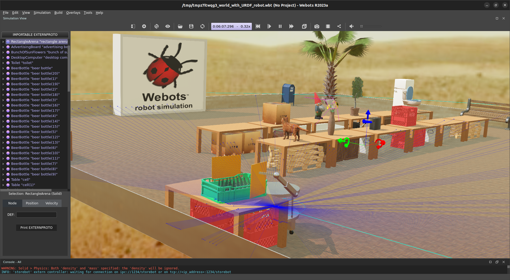
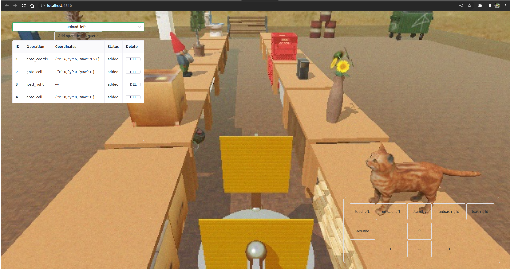
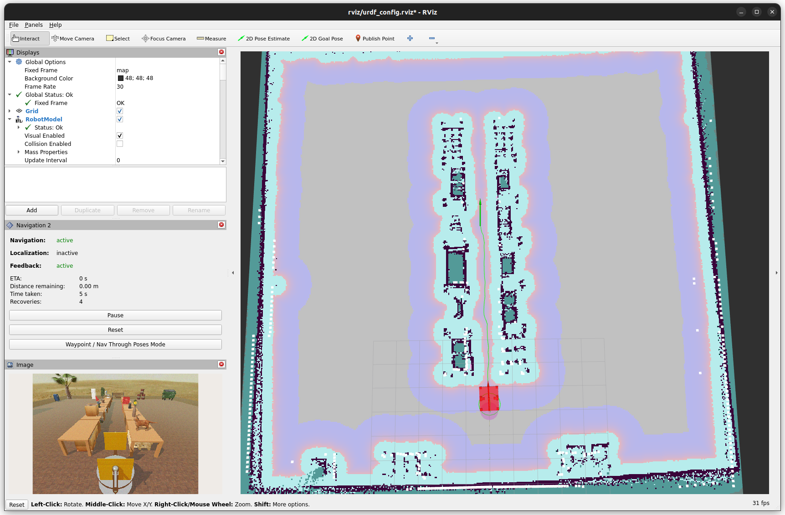

# Store automation in vacuum with ROS2 and Webots
This is an example project realizing manual and atonomous control of a robot which operates some goods on an improvising store.

## Docker
Everything runs inside an awesome [memristor mep3 docker](https://github.com/memristor/mep3/tree/main/docker) which holds all needed for Webots and ROS2 development.

## Web interface
"Spherical remote operator" can control robot in vacuum through the web interface based on [VueJS 3](https://v3.ru.vuejs.org/) and [roslibjs](http://wiki.ros.org/roslibjs).

It is possible to control robot manually or to make a queue of a commands which robot will execute autonomously.

## Navigation2 atonomy
Autonomous navigation uses [Navigation 2](https://navigation.ros.org/) stack. It builds an occupancy grid and a costmap based on robot's lidar data, plans a path and moves robot along it.
